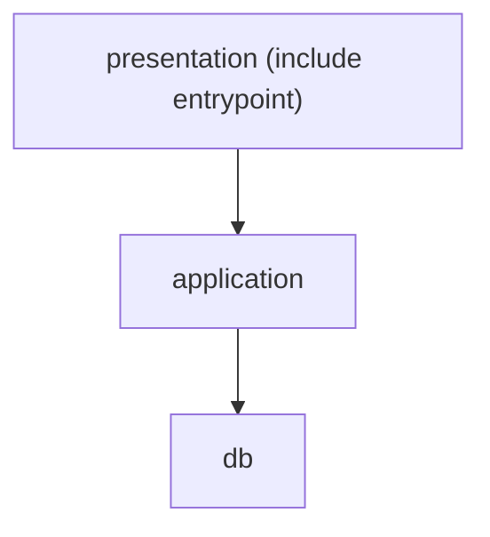
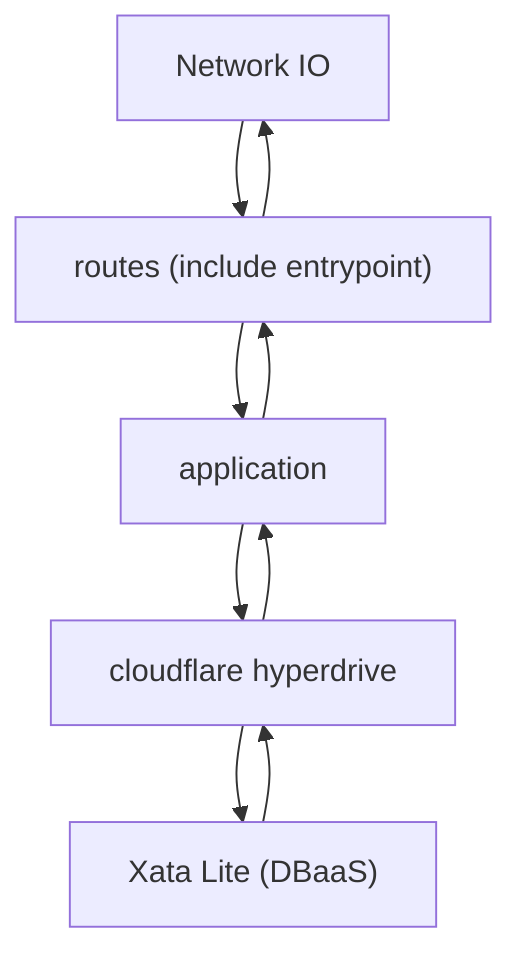

# pay-crew2 Backend

## `better-auth`の生成するスキーマファイルの更新方法

1. 設定ファイルの更新を行う。

better-authの設定は、`src/auth.ts`と`src/auth.cli.ts`に記述されている。
設定を更新するには、この2つのファイルに同じ設定内容を記述する必要がある。

- `src/auth.cli.ts`

better-auth CLIが`src/db/auth-schema.ts`を生成する際に参照する設定ファイル。

- `src/auth.ts`

better-authが実行時に参照する設定ファイル。

2. `pnpm run backend:better-auth:generate`を実行する。

```sh
pnpm run backend:better-auth:generate
```

3. `pnpm run backend:drizzle:generate`を実行する。

```sh
pnpm run backend:drizzle:generate
```

4. `pnpm run backend:migrate`を実行する。

```sh
pnpm run backend:migrate
```

## Xata LiteへのMigration方法

1. `products/backend/.env`の`DATABASE_URL`の値に対象のXata Liteのデータベースの`DATABASE_URL_POSTGRES`を設定する。

2. `pnpm run backend:migrate`を実行する。

※ 事前に`pnpm i && pnpm run backend:better-auth:generate`と`pnpm run backend:drizzle:generate`を実行しておくこと。

```sh
pnpm run backend:migrate
```

3. マイグレーションが完了したら、`products/backend/.env`の`DATABASE_URL`の値を元の状態に戻す (削除する) 。

## Workersと接続するHyperdriveを変更する方法

1. `products/backend/wrangler.jsonc`の`HYPERDRIVE`の`ID`を変更する。

```jsonc
{
  "$schema": "node_modules/wrangler/config-schema.json",
  "name": "pay-crew2-backend",
  "main": "src/index.ts",
  "compatibility_date": "2025-12-03",
  "compatibility_flags": ["nodejs_compat"],
  "hyperdrive": [
    {
      "binding": "HYPERDRIVE",
      "id": "", // <- ここを変更する
    },
  ],
}

```

2. `pnpm run backend:deploy`を実行する。

```sh
pnpm run backend:deploy
```

3. デプロイが完了したら、`products/backend/wrangler.jsonc`の`HYPERDRIVE`の`ID`を`""` (元の状態) に戻す。

※ HyperdriveのIDが漏洩すると、他者にデータベースを操作される可能性があるため、デプロイ完了後は必ず元に戻してからステージング (`git add`) をすること。

## 構造

この構造は、レイヤードアーキテクチャから着想を得て定義している。

このプロジェクトでは、hyperdriveによってDB接続が抽象化されている。
また、drizzleというORMを使用してDB操作も抽象化している。
そのため、infrastructure層は不要と判断し、用意していない。

### presentation (presentation/shareを除く)

ルーティングの定義を行う。

- 外部依存
  - hono
  - @hono/zod-openapi
  - zod-openapi-share


#### presentation/share

presentation層で共通して使用するエンティティを定義する。

### application

ビジネスロジック及びデータベースCRUD操作の定義を行う

- 外部依存
  - drizzle

### db

データベーススキーマの定義を行う

- 外部依存
  - Drizzle

### openapi

openapi.jsonの生成を行う処理を定義している。

`pnpm run backend:openapi`で生成できる。

- 外部依存 (間接的な依存も含む)
  - hono
  - @hono/zod-openapi
  - zod-openapi-share

## 依存関係



## 処理の流れ

