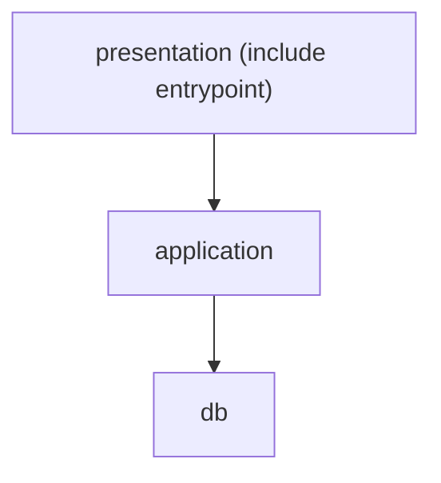
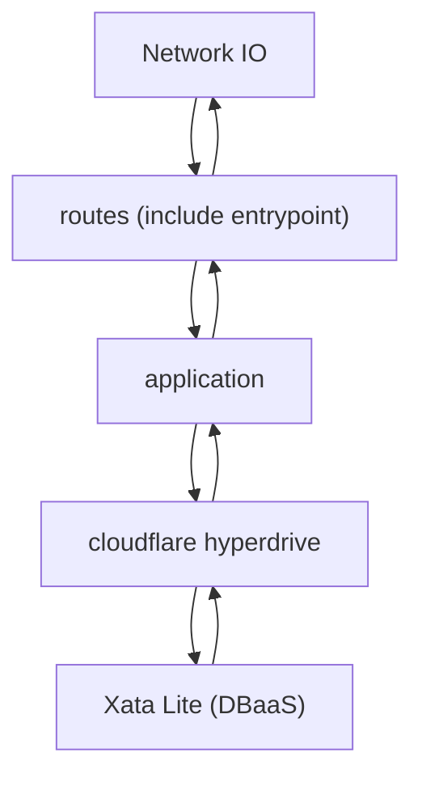

# pay-crew Backend

## 構造

この構造は、レイヤードアーキテクチャから着想を得て定義している。

このプロジェクトでは、hyperdriveによってDB接続が抽象化されている。
また、drizzleというORMを使用してDB操作も抽象化している。
そのため、infrastructure層は不要と判断し、用意していない。

### presentation (presentation/shareを除く)

ルーティングの定義を行う。

- 外部依存
  - hono
  - @hono/zod-openapi
  - zod-openapi-share

#### presentation/share

presentation層で共通して使用するエンティティを定義する。

### application

ビジネスロジック及びデータベースCRUD操作の定義を行う

- 外部依存
  - drizzle

### db

データベーススキーマの定義を行う

- 外部依存
  - Drizzle

### openapi

openapi.jsonの生成を行う処理を定義している。

`pnpm run backend:openapi`で生成できる。

- 外部依存 (間接的な依存も含む)
  - hono
  - @hono/zod-openapi
  - zod-openapi-share

## 依存関係

## 処理の流れ

