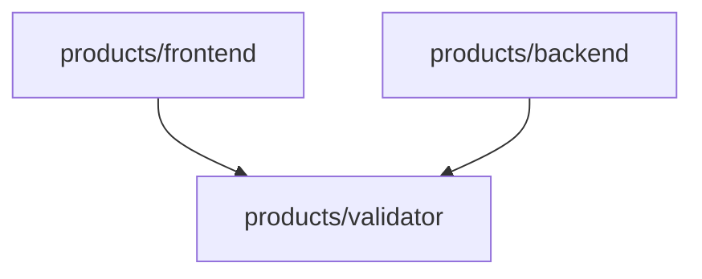

# pay-crew2 Validator

## 概要

`products/frontend`、`products/backend`で使用する
Zodのスキーマを定義する。
FrontendとBackend共にこのpackageを参照することで、
スキーマの定義の揺れを防いでいる。

## 依存関係

```mermaid
flowchart TD
    frontend["products/frontend"]
    backend["products/backend"]
    validator["products/validator"]

    frontend --> validator
    backend --> validator
```
